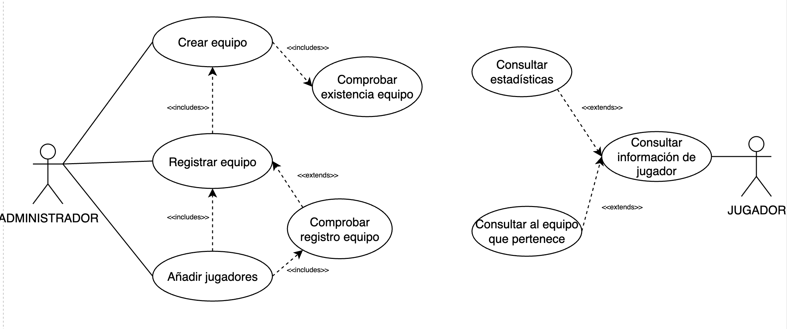
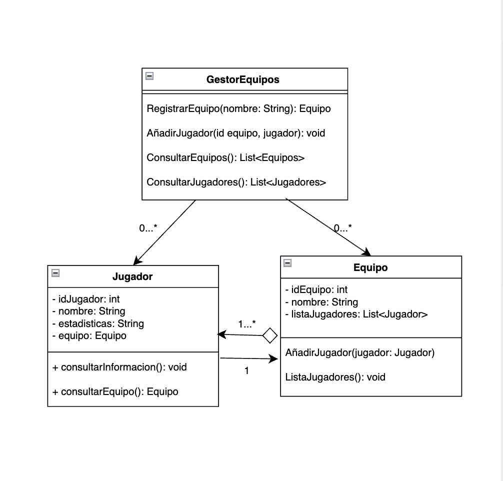

# torneo-esports-uml
Actividad del tercer trimestre de Entornos de Desarrollo

## Autor
Marta Guillén Escudero  
Github: @mge1905

## Descripción del proyecto
En el proyecto se muestra el diseño UML de un sistema de gestión de torneos en eSports. Se atiende en especial la gestión de equipos y jugadores usando un diagrama de casos de uso y un diagrama de clases.

## Link al repositorio:
https://github.com/mge1905/torneo-esports-uml

### Diagrama de Casos de Uso

### Diagrama de Clases

## Justificación del diseño

### ¿Quiénes son los actores que interactúan con el sistema?

**Administrador**: Responsable de la gestión del sistema. Incluye el registro de equipos, añadir jugadores a los equipos y consultar la lista de los equipos y jugadores. Además, la creación de torneos, inscripción de equipos, gestión de jugadores, registro de resultados y actualización de clasificaciones.

**Jugador**: Puede consultar la información de su equipo, sus estadísticas personales. Además, solicitar su participación en un torneo.

---

### ¿Cuáles son las acciones que cada actor puede realizar?

#### ADMINISTRADOR
- Registrar equipos
- Añadir jugadores a los equipos
- Consultar la lista de los equipos y jugadores
- Crear torneos
- Inscribir equipos
- Gestionar jugadores
- Registrar los resultados
- Actualizar clasificaciones

#### JUGADOR
- Consultar su propia información
- Consultar la información de su equipo
- Consultar sus estadísticas personales
- Solicitar participación en un torneo

---

### ¿Cómo se relacionan entre sí las entidades del sistema?

- **Jugador**: Un jugador pertenece a un único equipo.
- **Equipo**: Un equipo está compuesto por uno o varios jugadores.

Además:

- **Torneo**: Es la competición de eSports en sí. Un torneo está compuesto por varios equipos y partidas. Tiene la lógica para organizar las partidas y registrar resultados.
- **Partida**: Una partida consta de dos equipos que compiten. Está asociada a un torneo.
- **Resultados**: Se asocian a una partida. Tienen el equipo ganador de una partida.

---

## Clases

### De entidad:

**Jugador**
- idJugador: int
- nombre: String
- estadisticas: String
- equipo: Equipo

Métodos:
- consultarInformacion(): void
- consultarEquipo(): Equipo

**Equipo**
- idEquipo: int
- nombre: String
- listaJugadores: List<Jugador>

Métodos:
- añadirJugador(jugador: Jugador)
- listarJugadores(): void

---

### De control:

**GestorEquipos**
- registrarEquipo(nombre: String): Equipo
- añadirJugador(id equipo, jugador): void
- consultarEquipos(): List<Equipo>
- consultarJugadores(): List<Jugador>

---

### Justificación de relaciones

Un equipo contiene varios Jugadores, pero los jugadores pueden seguir existiendo aunque el equipo desaparezca. Por eso es agregación, no tiene la pertenencia absoluta. Un equipo debe tener al menos un jugador para existir.

Un jugador conoce a su equipo, es decir, que sabe a qué equipo pertenece. Cardinalidad 1 porque un jugador debe pertenecer siempre a un equipo.

El GestorEquipos gestiona los jugadores y equipos, pero no le pertenecen. Su cardinalidad es 0...* porque el Gestor puede gestionar de cero o muchos jugadores o de 0 a muchos equipos.

---

## Conclusiones
Este diseño constituye la base de lo que luego sería la aplicación. Pienso que gracias a esto he conseguido ver lo que sería la planificación y, por tanto, el contexto que envuelve a los proyectos, lo que sería la estructura de los proyectos de Java que hemos estado haciendo hasta ahora.

---

## Dificultades
Creo que ha sido una actividad que se me ha hecho muy difícil de hacer, he tardado mucho tiempo ya que he tenido que documentarme sobre cómo hacerlo desde el principio. Los apuntes han sido muy confusos y además pienso que finalmente tuvimos poco tiempo para la entrega. Haciendo la entrega me he encontrado con las siguientes dificultades:

- Dificultades en entender las relaciones (agregación y composición). Diferencia entre asociación simple, agregación y composición.
- Entender si las cardinalidades funcionaban igual que en el modelo E/R.
- Entender el orden correcto en el que debían colocarse las clases en el diagrama para que quedara claro el flujo de control y dependencia entre ellas.

Pienso que en clase no hemos visto los suficientes ejemplos e intentar complementarlo con el libro me ha confundido aún más.
